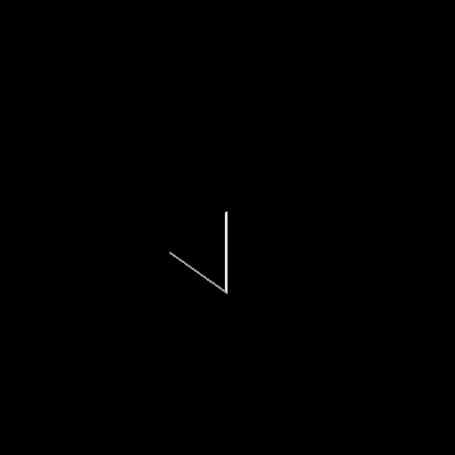

# Octree

Octree implementation.

## Setup

Run `setup.sh` to create directories and compile executables.

## Tests

### Octree

Test the plain octree implementation with

```
./bin/octree/octree < data/octree/test.in
```

### 3D Image Octree

There are two supported 3D image formats: binary images and RGB images.

#### Binary images

Binary images consist of pixels whose values are either 0 or 1. In these kind of images, both the original an reconstructed image are the same. We can observe this behavior by running the following lines

```
./bin/binary/reconstruction < data/binary/sphere.in
```

which load a binary 3D image of a sphere. If needed, custom sphere images can be generated with `./bin/data/sphere` which receives the radius of the sphere as input. To test any manually generated 3D image, first give the width, height and depth of the image in a first line, followed by width \* height \* depth chars (0 or 1), as in data/binary/sphere.in.

#### RGB images

RGB images are composed of pixels with red, green and blue channels whose values range between 0 and 255.

Example scan, from one corner to its oposite.



Generated with

```
./bin/rgb/scan data/mri/
```

giving `135 45 0 40` as input.
