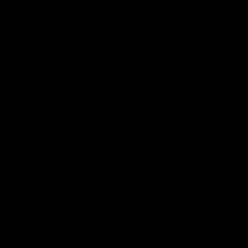
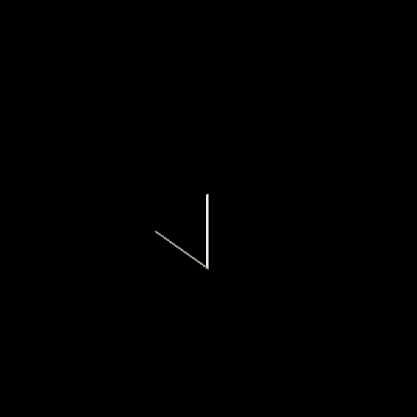
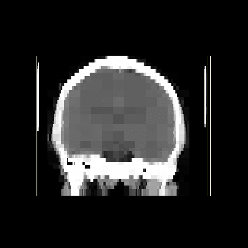

# Octree

Octree implementation for MRI image three-dimensional slicing.

## Setup

Run `setup.sh` to create directories and compile executables.

## Structures

### Octree

Test a plain octree implementation with

```
./bin/octree/tree < data/octree/tree.in
```

which returns a tree of nodes as the one shown below

```
    [3] (4, 5, 0): b
        [6] (3, 6, 3): c
[0] (2, 4, 6): a
    [5] (3, 0, 7): d
```

where, for each node
* Indentation level represents its the depth in the tree.
* The number inside the square brackets is its child number assigned by its parent.
* Its position in space is represented by the tuple.
* Data assigned to the node is shown after the colon.

### 3D Image Octree

There are two supported 3D image formats: binary images and RGB images.

#### Binary images

Binary images consist of pixels whose values are either 0 or 1. In these kind of images, both the original an reconstructed image are the same. We can observe this behavior by running the following lines

```
./bin/binary/reconstruction < data/binary/sphere.in
```

which load a binary 3D image of a sphere. If needed, custom sphere images can be generated with `./bin/data/sphere` which receives the radius of the sphere as input. To test any manually generated 3D image, first give the width, height and depth of the image in a first line, followed by width \* height \* depth chars (0 or 1), as in data/binary/sphere.in.

#### RGB images

RGB 3D images are composed of pixels with red, green and blue channels whose values range between 0 and 255. In order to build a lightweight octree in this setup, we require a threshold to determine when to divide a quadrant. When the difference between the minimum and maximum average channel value is below the threshold, all the pixels of the quadrant are considered of the same color; hence, the quadrant is no further divided. The operations performed over RGB images are described in the next section.

## Usage

Two structures to represent a 3D image can be chosen for the programs of this section: grid image representation and octree image representation. Each of the programs of this section require two arguments:

1. path: Directory in which images of the same MRI are stored.
2. structure: Data structure used to represent the image after loading it to memory. Supported structures are 'grid' and 'octree'. 

An example call is

```
./bin/rgb/slice <path> <structure>
```

During execution the program will wait for user input. The input format can vary according to the selected structure and program.

**_Note_**: when the selected structure is 'octree', the first input is **always** the threshold the octree uses to compress the image. A 'grid' does not require such parameter. Examples of inputs for each program and structure can be found on 'data/input'.

### Slicing

The main functionality implemented over 3D image model representations for this project is slicing, which is performed by `bin/rgb/slice`. In this program, the input is given as follows. Rotation angles in the sexagesimal system for the x axis, y axis and z axis are required in that order. Then, the depth of the cut is expected followed by the desired image size. An example slicing is 

```
./bin/rgb/slice data/mri grid < data/input/grid_corner_slice.in
```

### Scan

With an encapsulated slicing method implemented, we can perform multiple slices following the direction of a vector to obtain a series of consecutive images that show the evolution of the image cut along the vector over time. The program used for this purpose is `bin/rgb/scan` and requires first the x axis, y axis and z axis rotation angles as input, followed by the number of cuts to perform along the z axis relative to the observer. An example call is shown below

```
./bin/rgb/scan data/mri octree < data/input/octree_frontal_scan.in
```

### Rotation

As with the scanning program, we can create the illusion of rotation along a given axis with `bin/rgb/rotation`. The first arguments are the rotation angles along the x axis, y axis and z axis in that order. The second argument is the axis in which the rotation is performed, given as a char. The third argument is the number of slices to take for a 360 degree rotation. The call from below performs a sample rotation

```
./bin/rgb/rotation data/mri grid < data/input/grid_rotation.in
```

## Tests

### Execution time

Both the octree and grid representations of a 3D image implement a slicing function. To measure and compare the execution time of both structures we can run

```
./bin/measure/time data/mri <structure>
```

and give the number of queries as input. In this program, the structure is required to perform the given number of random slices, each of which is saved in `data/random`.

### RAM usage

RAM usage varies with different values of threshold for octree image compression. An estimate of RAM in use when an image is loaded as a grid or an octree can be obtained by executing the following lines

```
./bin/measure/ram data/mri <structure>
```

## Results

| Grid | Octree |
| ---- | ------ |
| <br> `./bin/rgb/scan data/mri/ grid < data/input/grid_frontal_scan.in` | <br> `./bin/rgb/scan data/mri/ octree < data/input/octree_frontal_scan.in` |
| <br> `./bin/rgb/scan data/mri/ grid < data/input/grid_corner_scan.in` | <br> `./bin/rgb/scan data/mri/ octree < data/input/octree_corner_scan.in` |
| <br> `./bin/rgb/rotation data/mri/ grid < data/input/grid_rotation.in` | <br> `./bin/rgb/rotation data/mri/ octree < data/input/octree_rotation.in` |

Create a GIF from a set of images by running

```
./docs/make_gif.sh <data_directory>
```

where 'data\_directory' stores a set of sorted images. The result is saved as `result.gif` on the root directory.
